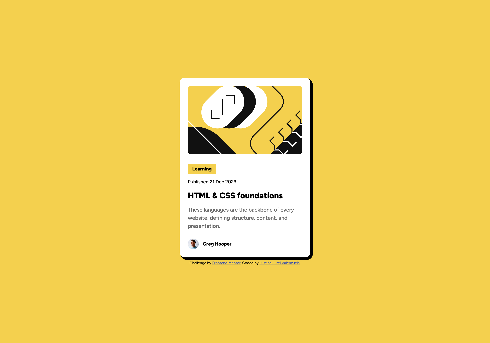
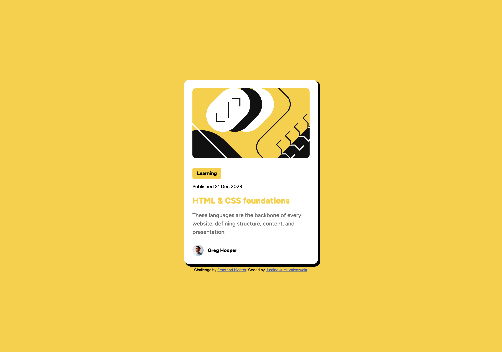
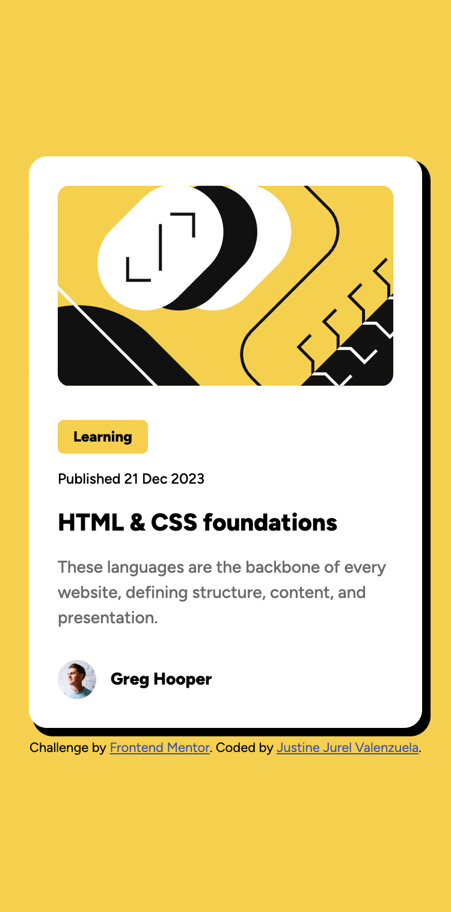

# Frontend Mentor - Blog preview card solution

This is a solution to the [Blog preview card challenge on Frontend Mentor](https://www.frontendmentor.io/challenges/blog-preview-card-ckPaj01IcS). Frontend Mentor challenges help you improve your coding skills by building realistic projects.

## Table of contents

- [Overview](#overview)
  - [The challenge](#the-challenge)
  - [Screenshot](#screenshot)
  - [Links](#links)
- [My process](#my-process)
  - [Built with](#built-with)
  - [What I learned](#what-i-learned)
  - [Continued development](#continued-development)
  - [Useful resources](#useful-resources)
  - [AI Collaboration](#ai-collaboration)
- [Author](#author)

## Overview

### The challenge

Users should be able to:

- See hover and focus states for all interactive elements on the page

### Screenshot

### Links

- Solution URL: [Github Repo](https://github.com/valenzuelajustinejurel/frontend-mentor-challenges/tree/main/blog-preview-card)
- Live Site URL: [Github live page](https://valenzuelajustinejurel.github.io/frontend-mentor-challenges/blog-preview-card/)

## My process

### Built with

- Semantic HTML5 markup
- CSS custom properties
- Flexbox
- Mobile-first workflow

### What I learned

I tried to make use the best practices on naming the classes. Making the style file clean and reusable. Making it reusable is time consuming because I need to make css variables. But I have fun building the simple card. Also trying to get used to BEM methodology.

### Continued development

This is my 2nd project I built here at frontend mentor and so far I am having fun. I am excited to move forward to the next project but will not rush things and let myself rest. Being organized in coding is good because of the readability of code and you are not also confuse on what you are writing.

### Useful resources

- [MDN](https://developer.mozilla.org/en-US/) - I always go here before asking AI. A great reference if you are looking what you need on your code.

### AI Collaboration

I am trying not to use AI on early stage. On this project. I did not use AI purely using google and MDN. But surely will use AI as the projects gets difficults

## Author

- Frontend Mentor - [@valenzuelajustinejurel](https://www.frontendmentor.io/profile/valenzuelajustinejurel)
