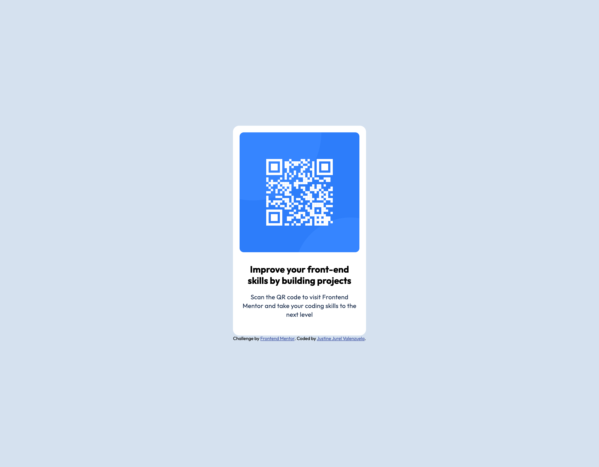

# Frontend Mentor - QR code component solution

This is a solution to the [QR code component challenge on Frontend Mentor](https://www.frontendmentor.io/challenges/qr-code-component-iux_sIO_H). Frontend Mentor challenges help you improve your coding skills by building realistic projects.

## Table of contents

- [Overview](#overview)
  - [Screenshot](#screenshot)
  - [Links](#links)
- [My process](#my-process)
  - [Built with](#built-with)
  - [What I learned](#what-i-learned)
  - [Continued development](#continued-development)
  - [AI Collaboration](#ai-collaboration)
- [Author](#author)

## Overview

### Screenshot

### Links

- Solution URL: [Github Repo](https://github.com/valenzuelajustinejurel/qr-code-component)
- Live Site URL: [Github Page live](https://valenzuelajustinejurel.github.io/qr-code-component/)

## My process

### Built with

- Semantic HTML5 markup
- CSS custom properties
- Flexbox
- Mobile-first workflow

### What I learned

This is my first project here at Frontend Mentor. I learned to google my way out and overcoming the anxiety of building something. I am trying to learn full stack development and not use AI without knowing what I am building.

### Continued development

Will Continue on proceeding the learning path

### AI Collaboration

In this learning path, I will not use AI as of the moment.

## Author

- Frontend Mentor - [@valenzuelajustinejurel](https://www.frontendmentor.io/profile/valenzuelajustinejurel)
