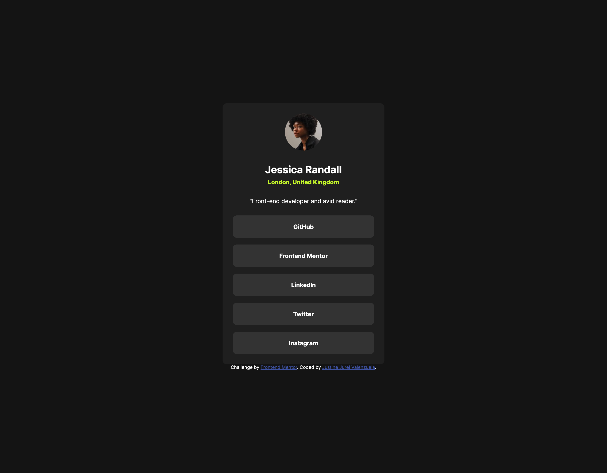
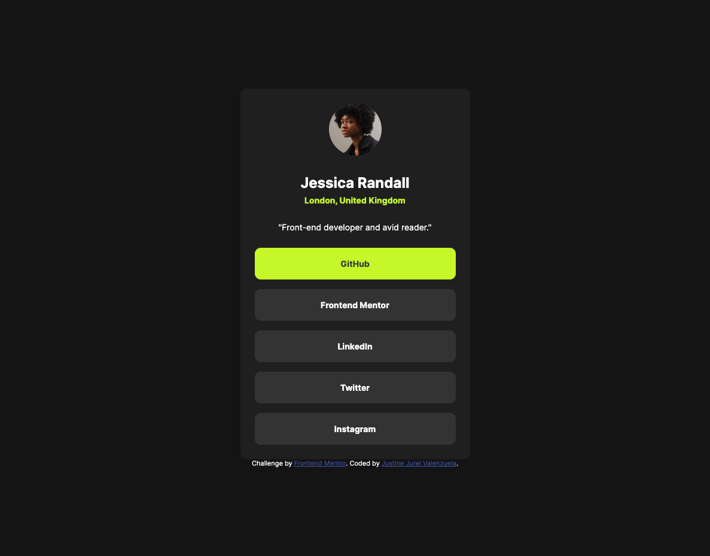
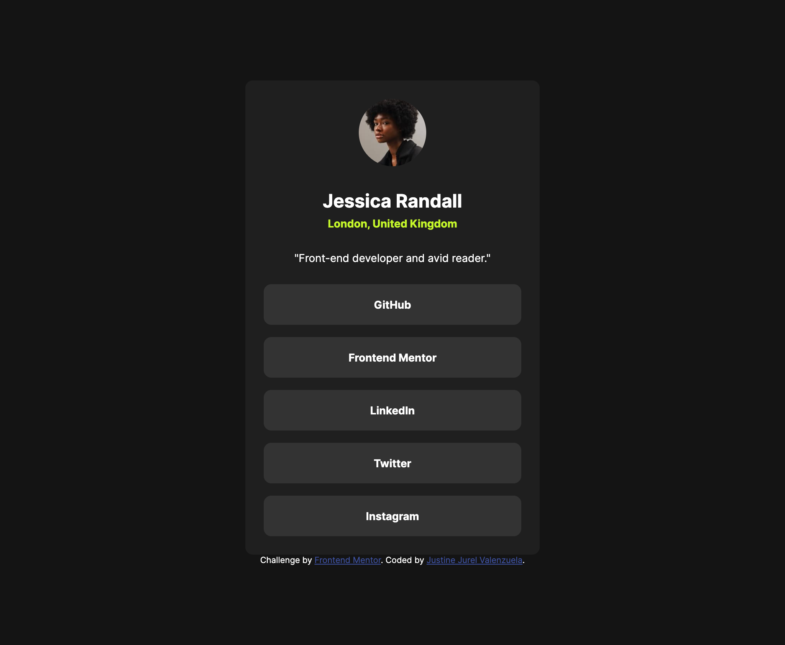
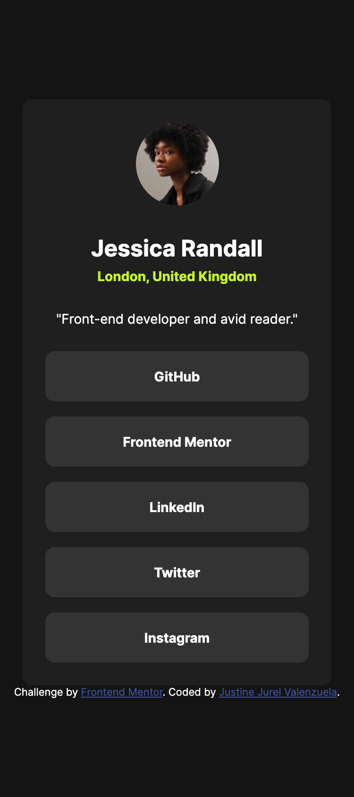

# Frontend Mentor - Social links profile solution

This is a solution to the [Social links profile challenge on Frontend Mentor](https://www.frontendmentor.io/challenges/social-links-profile-UG32l9m6dQ). Frontend Mentor challenges help you improve your coding skills by building realistic projects.

## Table of contents

- [Overview](#overview)
  - [The challenge](#the-challenge)
  - [Screenshot](#screenshot)
  - [Links](#links)
- [My process](#my-process)
  - [Built with](#built-with)
  - [What I learned](#what-i-learned)
  - [Continued development](#continued-development)
  - [Useful resources](#useful-resources)
  - [AI Collaboration](#ai-collaboration)
- [Author](#author)

## Overview

### The challenge

Users should be able to:

- See hover and focus states for all interactive elements on the page

### Screenshot

### Links

- Solution URL: [Github Repo](https://github.com/valenzuelajustinejurel/frontend-mentor-challenges/tree/main/social-links-profile)
- Live Site URL: [Github Live Page](https://valenzuelajustinejurel.github.io/frontend-mentor-challenges/social-links-profile/)

## My process

### Built with

- Semantic HTML5 markup
- CSS custom properties
- Flexbox
- Mobile-first workflow

### What I learned

I did research on how to tacket the buttons whether to use button tags or anchor tags. It boils down on how will the buttons will be used, its either interactivity or linking. So I used the nav tag parent then underordered list with anchor tags. I learned to designed them to look like buttons and do some hover with it. Then using the :not(:last-child) on my css. Which makes me proud. Small wins and I felt the satisfaction.

### Continued development

Now I can develop card component easily and would like to take the challenge on tackling a little bit difficulty on the next project. I keep repeating on using the simple css and flex then mobile first approach. Not letting myself stress on making fast progress, I am taking my time on learning and research the things I am lacking which is frustrating but once solved its worth it. Its like a dophamine hit that you want to go back always in coding.

### Useful resources

- [MDN](https://developer.mozilla.org/en-US/)
- [GOOGLE](https://www.google.com/)

### AI Collaboration

No AI for now but will sure hit the wall and will ask AI for some assitance and not make the AI build the project for me.

## Author

- Frontend Mentor - [@valenzuelajustinejurel](https://www.frontendmentor.io/profile/valenzuelajustinejurel)
